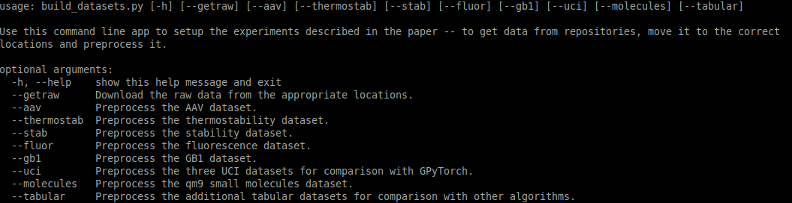
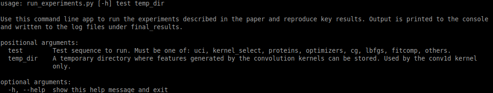

# benchmarking_xGPR

This repo contains code used to benchmark the xGPR package,
version 0.1.1.6, for Parkinson et al. 2023. It is highly
recommended to use this version of xGPR when running
scripts from this repository. For more information about
the xGPR package, refer to [the docs](https://xgpr.readthedocs.io/en/latest/index.html).

### Installation

To run this repo, you will need to install the dependencies
under requirements.txt. This is designed to run on Linux
and requires a GPU with CUDA. xGPR itself it should be noted requires
only numpy, cupy, Cython, CUDA >= 10.0, and
scikit-learn. The majority of
the dependencies are not required in order for xGPR to run;
they are needed for feature generation, data preprocessing,
running comparator experiments etc. 

### Datasets

There are 11 publicly available datasets used in the 20 benchmarks
for this study. The `build_datasets` script contains the tools
needed to download those not already included with the repo.
Note that when retrieving these public datasets, `build_datasets`
depends on links maintained by other groups (e.g. the UCI Machine
Learning Repository, the FLIP benchmarks, etc.) so is only
guaranteed to work so long as those links are maintained.

### Constructing datasets

The ``build_datasets`` script contains the functionality needed
to preprocess raw data and generate features for training an
xGPR model. A list of the available datasets you can construct
can be retrieved by running the script from command line, e.g.:

```
    python build_datasets.py
```

which will retrieve a list like the following:



so that you can construct the datasets most relevant to the experiments
that interest you. Note that the amount of disk space taken up by all
constructed datasets is quite substantial (about 150 GB). This is
because there are many datasets, some of the datasets have a substantial
memory footprint in and of themselves (e.g. QM9), the feature representations
for some datasets (e.g. SOAP features for QM9 and ESM embeddings for
sequences) are large, and many datasets are encoded using more than
one feature representation to permit comparisons.

Feature construction does not take up very much memory for *most* operations
with the exception of generating ESM (large language model) embeddings for protein sequences,
which can require substantial memory (>8 GB of RAM for some datasets) due to the large size
of the FAIR-ESM model and the embeddings it generates; we have tried to minimize these
requirements by processing sequences in small batches. Generating the ESM embeddings
is the slowest step in the feature construction process. Overall, building all the
features for the various datasets is likely to take a few hours.

### Running experiments

The vast majority of the experiments described in Parkinson et al. can be
reproduced by running the ``run_experiments`` script. To see a
list of available experiments and choose one to run, enter:

```
    python run_experiments.py
```

which will retrieve instructions like the following:



so that you can reproduce the experiments of most interest to you.
Note that some experiments may take a few hours to run on GPU.
The `kernel_sel` experiment, for example, involves tuning hyperparameters
in triplicate with three different random seeds for 11 different
benchmarks, i.e. tuning 33 different models, and the proteins
experiment involves fitting 33 different models using the results
from ``kernel_sel``. To take another example, the `cg` experiment
involves fitting 8 different datasets using 8 different settings
each, some of which are highly nonoptimal and therefore slow.
Be prepared therefore for each experiment to take some time.

Note that unlike feature construction, fitting using xGPR has a
relatively small memory footprint and can be run easily on a GPU
with 8 GB of RAM or less.

### Additional experiments

A few additional experiments are available as Jupyter notebooks under
the `jupyter_notebook` folder.
